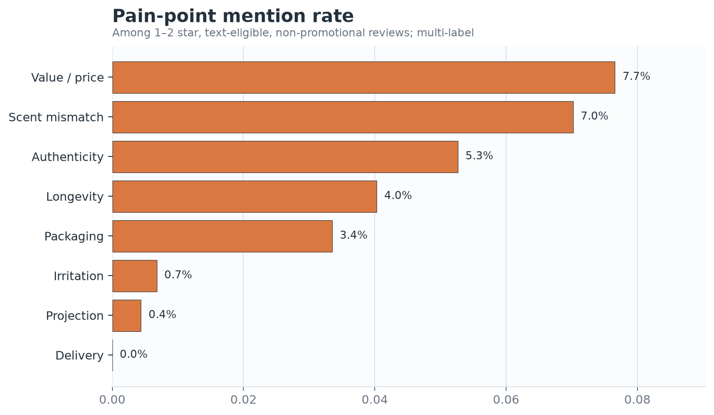
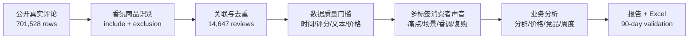

# Fragrance CMI Consumer Insights

[](https://github.com/magcianbbll-droid/fragrance-cmi-consumer-insights/actions/workflows/ci.yml)

一个可复现的香水消费者洞察项目：从 **701,528 条真实公开美妆评论**出发，完成可穿戴香氛筛选、去重、文本多标签、行为型分群、价格与竞品分析、52 周追踪，以及业务验证计划。项目不使用模拟的“小红书/抖音 1,800 条数据”，也不把评论量包装成市场份额。

## 一句话结论

消费者负向反馈首先指向**价值/价格、气味不符和真伪疑虑**；三者贡献已识别痛点标签的 **70.1%**。明确场景中**送礼**提及最高，消费者香调语言中**甜香/美食调**提及最高。业务上应优先验证“小规格降低试错风险”“场景 × 香调 × 性能预期内容”和“声量 × 满意度竞品追踪”，而不是直接声称这些动作会提升销量。

> 70.1% 是多标签痛点的**标签提及份额**，不是 70.1% 的消费者。所有结论均保留分母与限制。

## 交付物

- [消费者洞察报告](reports/consumer_insight_report.md)：答案优先的业务报告与 90 天验证计划
- [周度追踪工作簿](outputs/fragrance_cmi_weekly_tracker.xlsx)：13 个页签、KPI Dashboard、周度趋势、标签、竞品、价格带、指标字典和数据源
- [指标定义](docs/metric_definitions.md) 与 [标签词典/迭代记录](docs/label_codebook.md)
- [验证报告](docs/validation_report.md)：关键数字复算、数据质量和可视化 QA
- [面试讲法](docs/interview_story.md)：项目做了什么、为什么做、业务价值、结果和承担角色



## 真实跑数结果

| 环节 | 结果 | 口径 |
|---|---:|---|
| All Beauty 原始评论 | 701,528 | McAuley Lab Amazon Reviews 2023 |
| 商品元数据 | 112,590 | 同源 metadata |
| 可穿戴香氛商品 | 3,022 | 标题/品类命中，排除家居香氛、fragrance-free、空瓶等 |
| 匹配评论 | 14,813 | 按 `parent_asin` 关联，去重前 |
| 去重分析评论 | 14,647 | 去除 166 个复合键重复 |
| 文本有效评论 | 13,859 | 至少 20 字符、4 tokens；文本分析分母 |
| 负向文本分母 | 2,507 | 1–2 星、文本有效、非纯促销 |
| 价格覆盖 | 55.0% | 有商品美元标价的评论 |
| 验证购买 | 93.1% | 来源 `verified_purchase` 字段 |

## 这个项目支持什么业务决策

1. **产品/规格：** 试香套装或旅行装是否值得小流量验证，成功指标应看试香到正装转化与退款护栏。
2. **内容：** 从纯香调介绍转向“使用场景 × 气味语言 × 性能预期”，以商品页点击和有效互动而非单纯点赞评估。
3. **竞品：** 同时看评论声量、正向率、价格覆盖和痛点结构，避免用小样本均分做品牌排名。
4. **持续监测：** 用 52 周表追踪评论量、负向占比、验证购买、价格讨论和痛点变化；替换为企业获准的数据源即可更新。

## 方法链路



关键设计选择：

- 评论评分作为透明的情绪基准：4–5 星正向、3 星中性、1–2 星负向。
- 痛点、场景与香调允许一条评论命中多个标签；分母与多标签重叠单独说明。
- 行为分群按评论中的需求信号划分，不虚构年龄、城市、收入或性别。
- 价格讨论保留；只有短文本中的明确 affiliate/coupon/promo 信号才标记为纯促销噪声。
- 处理后文件不保存完整评论文本或原始用户 id。

## 复现

```bash
python -m venv .venv
# Windows: .venv\Scripts\activate
# macOS/Linux: source .venv/bin/activate
pip install -r requirements.txt
python scripts/download_data.py
python scripts/run_pipeline.py
pytest
```

原始压缩文件约 128MB，下载脚本会生成本地 SHA-256 清单。原始文件和行级处理结果都被 Git 忽略；仓库只提交代码、聚合表、图、报告和追踪工作簿。

Excel 工作簿由 `tools/build_tracker.mjs` 使用 Codex 提供的 `@oai/artifact-tool` 生成。Python 分析链路与静态报告不依赖该工具；仓库已包含最终验证过的 `.xlsx`。

## 仓库结构

```text
configs/                 标签与商品筛选词典
data/                    本地 raw/interim/processed（Git 忽略）
docs/                    口径、词典、验证、实验和面试材料
outputs/figures/         9 张报告图
outputs/tables/          可审计聚合表与质量指标
reports/                 主消费者洞察报告
scripts/                 下载、运行与清理入口
src/fragrance_cmi/       清洗、标签、分析、可视化和报告代码
tests/                   不依赖大文件的单元测试
tools/                   Excel 工作簿构建器
```

## 数据源与边界

数据来自 [McAuley Lab Amazon Reviews 2023](https://amazon-reviews-2023.github.io/) 的 All Beauty review 与 metadata，覆盖至 2023 年 8 月 30 日。本项目适合展示可复现 CMI 方法和消费者语言，不代表 2026 年实时趋势，不代表中国消费者总体，也不能用于估算销量或市场份额。详细来源与许可说明见 [DATA_SOURCES.md](DATA_SOURCES.md) 和 [DATA_LICENSES.md](DATA_LICENSES.md)。

项目代码采用 MIT License；第三方数据不由本仓库重新授权。
