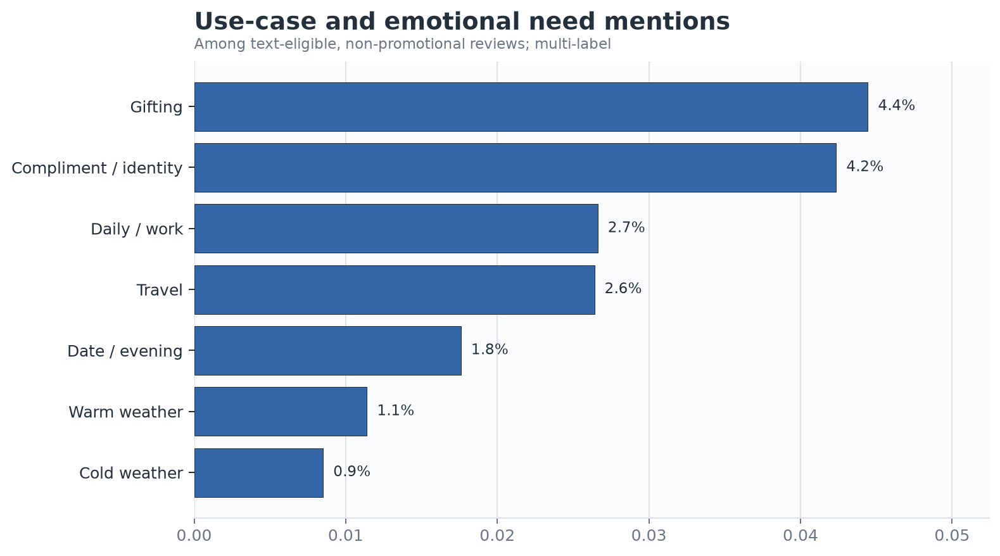
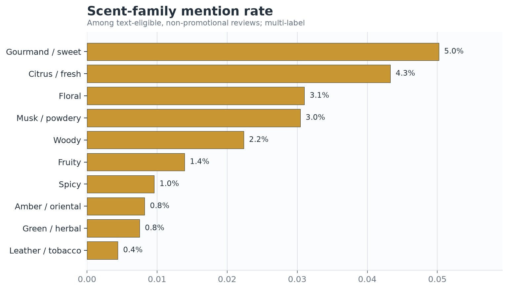
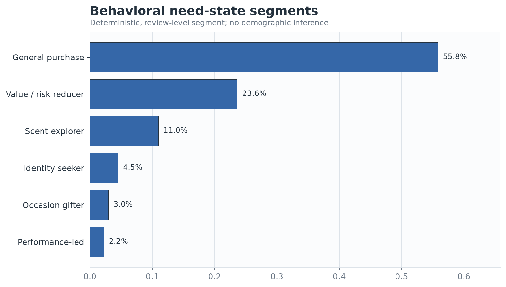
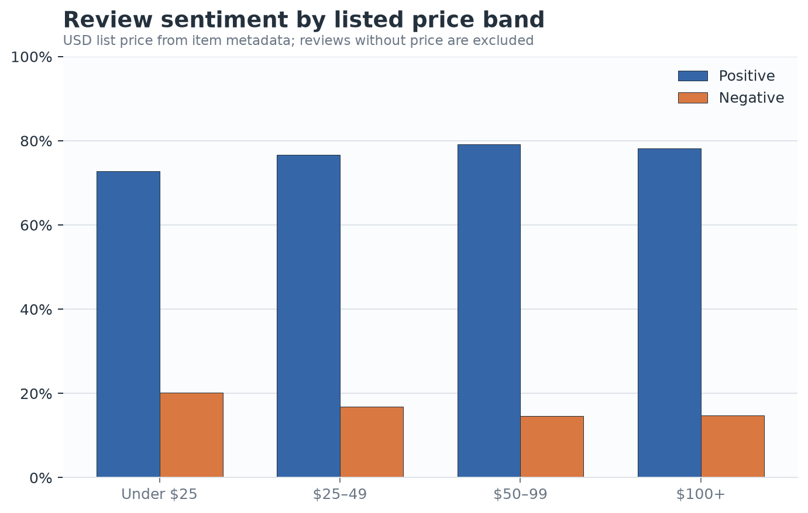
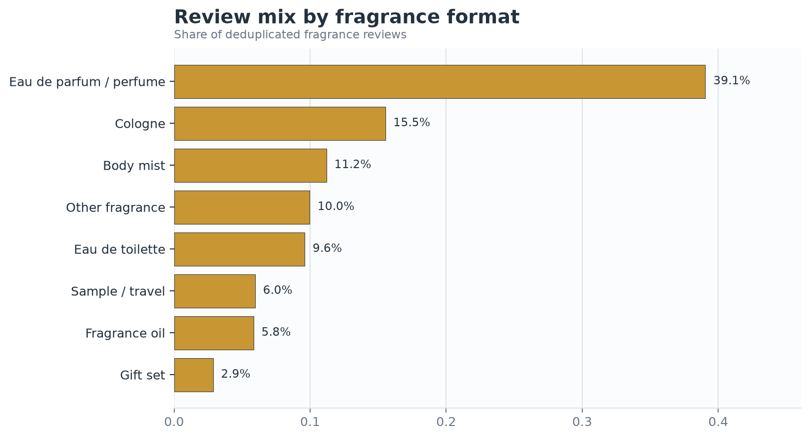
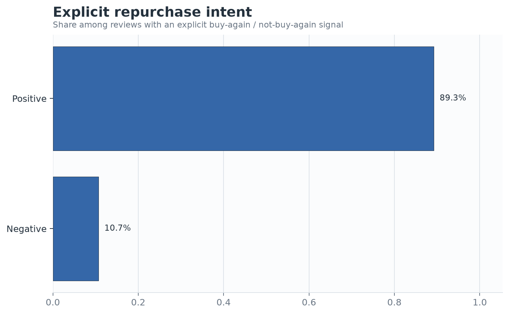
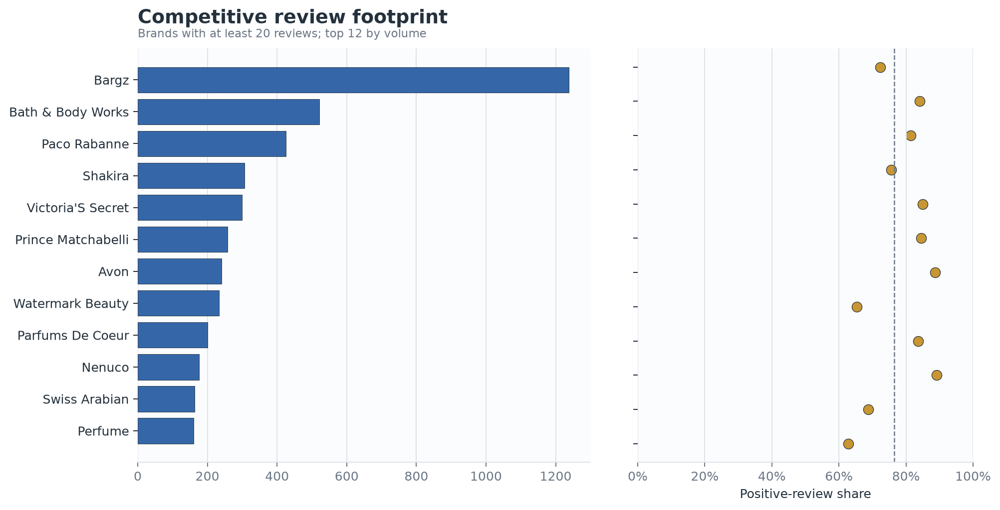
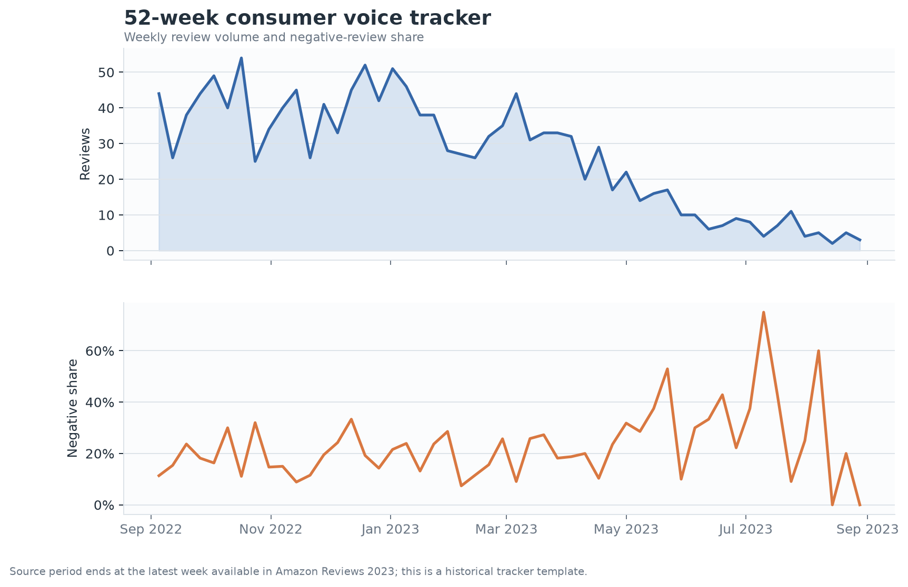

# 香水消费者洞察：从真实评论到可验证业务动作

## Executive Summary

- **先降低试错成本，再放大内容种草。** 在 14,647 条去重香氛评论中，负向评论最常被识别的痛点是“价格与价值感”（占负向有效文本的 7.7%）。这支持优先测试小规格/试香、明确留香与浓度预期，而不是直接承诺“更高级的味道”。
- **场景与气味教育应同时出现。** 最常见的明确使用需求是“送礼”（4.4%），最常见气味家族是“美食/甜香”（5.0%）。建议把内容单元写成“场景 × 香调 × 性能预期”，而不是只讲抽象香调。
- **竞品机会应看‘声量 × 满意度’，不能只看均分。** 具备至少 20 条评论的品牌中，评论声量领先者包括 Bargz、Bath & Body Works、Paco Rabanne；品牌比较同时呈现样本量与正向率，避免把小样本高分误当成强势竞品。
- **结论用于方向判断，不用于估算中国市场规模。** 数据来自 Amazon Reviews 2023 的 All Beauty 历史评论，截止 2023-08-30；它适合验证 CMI 方法和消费者语言，不代表小红书/抖音当期热度，也不能推断人口属性。

## 样本与指标口径先于结论

原始源包含 701,528 条 All Beauty 评论和 112,590 条商品元数据。关键词与排除规则筛出 3,022 个可穿戴香氛商品，关联后得到 14,647 条去重、时间与评分均有效的评论，覆盖 3,022 个实际被评论商品。文本分析使用 13,859 条长度达标且非纯促销的评论；负面痛点的分母是其中评分为 1–2 星的 2,507 条。

需求、痛点和香调允许一条评论命中多个标签，因此各标签提及率不会加总为 100%。评分情绪口径为：4–5 星正向、3 星中性、1–2 星负向。价格为抓取时商品页美元标价，评论层价格覆盖率为 55.0%，所有价格结论都只针对可匹配价格的评论。

## 负向口碑首先暴露性能与预期管理问题

前三项负向痛点为：价格与价值感 7.7%、气味与预期不符 7.0%、真伪疑虑 5.3%。图中分母固定为负向有效文本，横向条形图展示“有多少负面评论提到该痛点”；因为是多标签，一条评论可同时贡献留香、真伪和价格等多个问题。

**业务含义：** 商品页和内容应主动标注浓度、预期留香区间、扩散力与适用距离；对试香/旅行装设置清晰的正装抵扣机制，能同时回应气味不确定性与价格风险。数据只支持优先验证，不证明该机制一定提升购买。

## 消费者用“场景语言”理解香味

明确需求中排名靠前的是：送礼 4.4%、称赞/自我表达 4.2%、日常/通勤 2.7%。这些是评论中的主动提及率，而不是全部购买场景的市场份额；未写出场景的评论不会被强行归类。

香调语言以：美食/甜香 5.0%、柑橘/清新 4.3%、花香 3.1% 最常出现。香调标签来自消费者文本中的气味词，不等同于品牌官方香调分类，也不对未出现的香调做推断。

**业务含义：** 内容建议采用“何时用—闻起来像什么—性能如何”的三段式。以最高需求场景和最高频香调为第一批内容单元，同时保留对照组，验证其对点击、停留和试香转化的增量。

## 行为分群服务于动作，而不是虚构人口画像

每条有效评论按确定性规则进入一个主分群；最大分群为“general purchase”，占 55.8%。分群依据评论中表现出的性能、价格/风险、送礼、自我表达和探索信号，不推断年龄、性别、收入或城市。

**业务含义：** 该分群可直接对应 CRM/内容策略：性能导向看留香证据，风险降低型看试香和价格，送礼型看包装与决策简化，自我表达型看身份语境。下一步应在自有一方数据中校验分群与实际转化的关系。

## 价格和规格用于识别试错门槛

不同标价带的正负向评论占比如下；没有价格的评论不进入本图，因此不能把图中占比外推到整个品类。

明确表达复购/不复购的评论中，正向复购意向占 89.3%。这不是整体复购率：只有直接出现“buy again / repurchase”等表达时才进入分母。

**业务含义：** 小规格试香的价值主张应以“降低选错风险”为主，正装转化为主要结果指标；不把评论中的购买意向等同于真实复购行为。

## 竞品判断同时看声量、满意度与样本门槛

竞品图只保留至少 20 条评论的品牌，左侧展示评论声量，右侧展示正向评论占比，虚线为纳入品牌的中位数。这样能区分“声量大但存在口碑修复空间”和“小样本高分”两类情况。

**业务含义：** 对高声量、低于中位正向率的品牌，应进一步拆解痛点结构与商品格式；对高正向率但声量小的品牌，只作为概念/表达参考，不直接判断为市场领导者。

## 周度追踪表把一次性研究变成持续监测

下图使用数据集中最后 52 个自然周，分别跟踪评论量与负向评论占比。趋势图至少保留 52 个周点，但来源数据截止 2023 年，因此它是可复用的追踪模板，不是当前市场预警。

项目同时输出 `outputs/fragrance_cmi_weekly_tracker.xlsx`：包含 KPI、周度追踪、痛点、需求、香调、竞品、价格带和指标字典，可替换为企业自有社媒/电商源后更新。

## 90 天验证计划

1. **第 1–2 周：概念筛选。** 将“试香套装”“场景化内容”“香调教育”各做 2–3 个概念，用 5–10 人访谈补充消费者原话，并以小样本问卷评估理解度、相关性和购买考虑度。
2. **第 3–6 周：小流量 A/B 测试。** 测试试香入口 vs. 正装直购；主指标为试香购买转化率和正装后续转化率，辅助指标为商品页到达率，护栏指标为退款/取消率和客服咨询率。
3. **第 7–10 周：内容单元测试。** 对“场景 × 香调 × 性能预期”与常规产品内容做随机或准随机对照；主指标为有效互动率、商品页点击率，避免仅用点赞数判断。
4. **第 11–12 周：复盘与扩量。** 按分群和价格带检查异质性；只有当主指标改善且护栏不恶化时扩大投放。记录样本量、置信区间和停止规则，避免因多次查看结果而误判。

## Further Questions

- 中国消费者在小红书、抖音和天猫的场景/痛点结构是否与英文 Amazon 评论一致？
- 试香购买者到正装的 30/60/90 天转化与真实复购率是多少？
- 不同品牌、浓度和规格下，留香抱怨是否由产品表现、预期管理或真伪疑虑驱动？
- 内容互动提升是否能传导到加购与成交，而非只提高浅层点赞？

## Caveats and Assumptions

- 这是公开电商评论的观察性文本研究，不能建立因果关系，也不能代表未发表评论的消费者。
- 数据截止 2023-08-30，不代表 2026 年实时市场；周度追踪用于展示可更新框架。
- 词典法优点是透明、可复算，缺点是会漏掉隐喻、否定和新俚语；关键标签应抽样人工复核。
- 商品品牌与价格来自元数据，存在缺失、店铺名代替品牌名和抓取时点差异。
- 竞品声量是该数据集内评论量，不是销量或市场份额。
